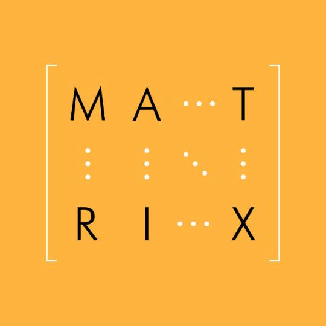

# Hillier & Grinblatt: Chapter 11: Investing in Risky Projects

Text

## Pre-lecture notes

Text

## Lecture notes

Text

## Exercises

### Exercise 11.1

*A project has an expected cash flow of €1 million one year from now. The standard deviation of this cash flow is €250,000. If the expected return of the market portfolio is 10 per cent, the risk-free rate is 5 per cent, the standard deviation of the market is 0.5, what is the present value of the cash flow? Assume the CAPM holds. (Hint: Use the certainty equivalent method.)* [@book, p.389]

### Exercise 11.2

*Exercises 11.2 - 11.6 make use of the following information.* [@book, p.389]

*Assume that BA Cityflyer has the following joint distribution with the market return:* [@book, p.389]

```{r fig.align="center", echo=FALSE, out.width = "150px",}

```

*Assume alse that the CAPM holds.* [@book, p.389]

*Compute the expected year 1 cash flow for BA Cityflyer.* [@book, p.389]

### Exercise 11.3

*Exercises 11.2 - 11.6 make use of the following information.* [@book, p.389]

*Assume that BA Cityflyer has the following joint distribution with the market return:* [@book, p.389]

```{r fig.align="center", echo=FALSE, out.width = "150px",}

```

*Assume alse that the CAPM holds.* [@book, p.389]

*Find the covariance of the cash flow with the market return and its cash flow beta.* [@book, p.389]

### Exercise 11.4

*Exercises 11.2 - 11.6 make use of the following information.* [@book, p.389]

*Assume that BA Cityflyer has the following joint distribution with the market return:* [@book, p.389]

```{r fig.align="center", echo=FALSE, out.width = "150px",}

```

*Assume alse that the CAPM holds.* [@book, p.389]

*Assuming that historical data suggest that the market risk premium is 8.4 per cent per year and the market standard deviation is 40 per cent per year, find the certainty equivalent of the year 1 cash flow. What are the advantages and disadvantages of using such historical data for market inputs as opposed to inputs from a set of scenarios, like those given in the table above exercise 11.2?* [@book, p.389]

### Exercise 11.5

*Exercises 11.2 - 11.6 make use of the following information.* [@book, p.389]

*Assume that BA Cityflyer has the following joint distribution with the market return:* [@book, p.389]

```{r fig.align="center", echo=FALSE, out.width = "150px",}

```

*Assume alse that the CAPM holds.* [@book, p.389]

*Discount your answer in exercise 11.4 at the risk-free rate of 4 per cent per year yo obtain the present value.* [@book, p.389]

### Exercise 11.6

*Exercises 11.2 - 11.6 make use of the following information.* [@book, p.389]

*Assume that BA Cityflyer has the following joint distribution with the market return:* [@book, p.389]

```{r fig.align="center", echo=FALSE, out.width = "150px",}

```

*Assume alse that the CAPM holds.* [@book, p.389]

*Explain why the answer to exercise 11.5 differs from the answer in example 11.2.* [@book, p.389]

### Exercise 11.7

*Start with the risk-adjusted discount rate formula. Derive the certainty equivalent formula by rearranging terms and that $b=\beta\times PV$.* [@book, p.389]

### Exercise 11.8

*In Section 11.3's illustration, asset values increased 10 per cent from 2012 to 2013, from €100 million to €110 million.* [@book, p.389]

a. *Compute the percentage increase in the value of equity if the firm is financed with €50 million in debt.* [@book, p.389]

b. *Compute the leverage ratio of this firm in 2013.* [@book, p.389]

### Exercise 11.9

*Explain intuitively why the certainty equivalent of a cash flow with a negative beta exceeds the cash flow's expected value.* [@book, p.389]

### Exercise 11.10

*Exercises 11.10 - 11.14 make use of the following data.* [@book, p.389]

*In 1989, General Motors (GM) was evaluating the acquisition of Hughes Aircraft Corporation. Recognizing that the appropriate discount rate for the projected cash flows of Hughes was different the its own cost of capital, GM assumed that Hughes had approximately the same risk as Lockheed or Northrop, which had low-risk defence contracts and products that were similarto Hughes. Specifically, assume the following inputs:* [@book, p.389]

```{r fig.align="center", echo=FALSE, out.width = "150px",}

```

*Analyse the Hughes acquisition (which took place) by first computing the betas of the comparison firms, Lockheed and Northrop, as if they were all equity financed. Assume no taxes.* [@book, p.390]
### Exercise 11.11

*Exercises 11.10 - 11.14 make use of the following data.* [@book, p.389]

*In 1989, General Motors (GM) was evaluating the acquisition of Hughes Aircraft Corporation. Recognizing that the appropriate discount rate for the projected cash flows of Hughes was different the its own cost of capital, GM assumed that Hughes had approximately the same risk as Lockheed or Northrop, which had low-risk defence contracts and products that were similarto Hughes. Specifically, assume the following inputs:* [@book, p.389]

```{r fig.align="center", echo=FALSE, out.width = "150px",}

```

*Compute the beta of the assets of the Hughes acquisition, assuming no taxes, by taking the average of the asset betas of Lockheed and Northrop.* [@book, p.390]

### Exercise 11.12

*Exercises 11.10 - 11.14 make use of the following data.* [@book, p.389]

*In 1989, General Motors (GM) was evaluating the acquisition of Hughes Aircraft Corporation. Recognizing that the appropriate discount rate for the projected cash flows of Hughes was different the its own cost of capital, GM assumed that Hughes had approximately the same risk as Lockheed or Northrop, which had low-risk defence contracts and products that were similarto Hughes. Specifically, assume the following inputs:* [@book, p.389]

```{r fig.align="center", echo=FALSE, out.width = "150px",}

```

*Compute the cost of capital for the Hughes acquisition, assuming no taxes.* [@book, p.390]

### Exercise 11.13

*Exercises 11.10 - 11.14 make use of the following data.* [@book, p.389]

*In 1989, General Motors (GM) was evaluating the acquisition of Hughes Aircraft Corporation. Recognizing that the appropriate discount rate for the projected cash flows of Hughes was different the its own cost of capital, GM assumed that Hughes had approximately the same risk as Lockheed or Northrop, which had low-risk defence contracts and products that were similarto Hughes. Specifically, assume the following inputs:* [@book, p.389]

```{r fig.align="center", echo=FALSE, out.width = "150px",}

```

*Compute the value of Hughes with the cost of capital estimated in exercise 11.12.* [@book, p.390]

### Exercise 11.14

*Exercises 11.10 - 11.14 make use of the following data.* [@book, p.389]

*In 1989, General Motors (GM) was evaluating the acquisition of Hughes Aircraft Corporation. Recognizing that the appropriate discount rate for the projected cash flows of Hughes was different the its own cost of capital, GM assumed that Hughes had approximately the same risk as Lockheed or Northrop, which had low-risk defence contracts and products that were similarto Hughes. Specifically, assume the following inputs:* [@book, p.389]

```{r fig.align="center", echo=FALSE, out.width = "150px",}

```

*Compute the value of Hughes if GM's cost of capital is used as a discount rate instead of the cost of capital computed from the comparison firms.* [@book, p.390]

### Exercise 11.15

*In a two-factor APT model, easyJet has a factor beta of 1.15 on the first factor portfolio, which is highly correlated with the change in GDP, and a factor beta of -0.3 on the second factor portfolio, which is highly correlated with interest rate changes. If the risk-free rate is 5 per cent per year, the first factor portfolio has a risk premium of 2 per cent per year, and the second has arisk premium of -0.5 per cent per year:* [@book, p.390]

a. *Compute the cost of capital for the BA Cityflyer project that uses easyJet as the appropriate comparison firm. Assume no taxes and no need for leverage adjustments.* [@book, p.390]

b. *What is the present value of an expected £1 million BA Cityflyer cash flow one year from now, assuming that easyJet is the appropriate comparison? Assume no taxes and no need for leverage adjustments.* [@book, p.390]

c. *What are the cash flow beta and the certainty equivalent for the BA Cityflyer project?* [@book, p.390]

### Exercise 11.16

*Risk-free rates at horizons of one year, two years and three years are 6.00 per cent per year, 6.25 per cent per year and 6.75 per cent per year, respectively. The manager of the space shuttle at Rockwell International forecasts respective cash flows of \$200 million, \$250 million and \$300 million for these three years under the risk-free scenario. Value each of these cash flows seperately.* [@book, p.390]