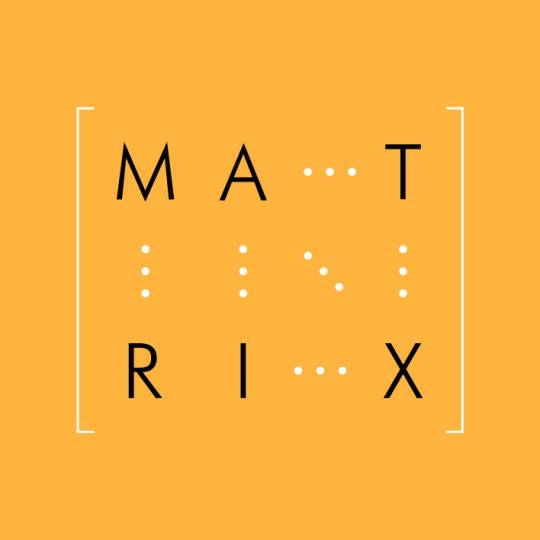

# Hillier & Grinblatt: Chapter 16: Bankruptcy Costs and Debt Holder-Equity Holder Conflicts

Text

## Pre-lecture notes

Text

## Lecture notes

Text

## Exercises

### Exercise 16.1

*A firm has £100 million in cash on hand, and a debt obligation of £100 million due in the next period. With this cash, it can take on one of two projects - A or B - which cost £100  million each. Assume that the firm cannot raise any additional outside funds. If the economy is favourable, project A will pay £120 million and project B will pay £101 million. If the economy is unfavourable, project A will pay £60 million and project B will pay £101 million. Assume that investors are risk neutral, there are no taxes or direct costs of bankruptcy, the riskless interest rate is zero, and the probability of each state 0.5.* [@book, p.550]

a. *What is the NPV of each project?* [@book, p.550]

b. *Which project will equity holders want the managers to take? Why?* [@book, p.550]

### Exercise 16.2

*Julio decides he can manufacture deep-fried Mars bars for one period and will have cash flows next period of €210 if the economy is favourable, and €66 if the economy is unfavourable. One-third of these proceeds must be paid out in taxes if the firm is all equity financed; however, because of the tax advantage of debt, Julio saves €0.05 in taxes for every €1.00 of debt financing that he uses. Assume investors are risk neutral, the riskless rate is 10 per cent per period, and the probability of each state is 0.5. Also assume that if Julio's firm goes bankrupt and debt holders take over, the legal fees and other bankruptcy costs total €20.* [@book, p.550-551]

a. *If Julio organizes his firm as all equity, what will it be worth?* [@book, p.551]

b. *Suppose Julio's firm sold a zero-coupon bond worth €44 at maturity next period. How much would the firm receive for the debt?* [@book, p.551]

c. *With the debt level above, how much would the equity be worth?* [@book, p.551]

d. *How much would the firm be worth?* [@book, p.551]

e. *Would the firm be worth more if it had a debt obligation of €70 next period?* [@book, p.551]

### Exercise 16.3

*A firm has a senior bond obligation of €20 due this period and €100 next period. It also has a subordinated loan of €40 owed to Jack and Jill and due next period. It has no projects to provide cash flows this period. Therefore, if the firm cannot get a loan of €20, it must liquidate. The firm has a current liquidation value of €120. If the firm does not liquidate, it can take one of two projects with no additional investment. If it takes project A, it will receive cash flows of €135 next period, for sure. If the firm takes project B, it will receive cash flows of either €161 or €69 with equal probability. Assume risk neutrality, a zero interest rate, no direct bankruptcy costs and no taxes.* [@book, p.551]

a. *Which has a higher PV: liquidating, project A, or project B?* [@book, p.551]

b. *Should Jack and Jill agree to lend the firm €20 it needs to stay operating if they receive a (subordinated) bond with a face value of €20.50?* [@book, p.551]

c. *If the firm does receive the loan from Jack and Jill, which project will the managers choose if they act in the interest of the equity holders?* [@book, p.551]

### Exercise 16.4

*Larsson Fashion Corporation (LFC) can pursue either project Dress or project Cosmetic, with possible pay-oods at year-end as follows:* [@book, p.551]

```{r fig.align="center", echo=FALSE, out.width = "150px",}

```

*Each project costs SKr60 million at the beginning of the year. Assume there are no taxes, there are no direct bankruptcy costs, all investors are risk neutral, and the risk-free interest rate is zero.* [@book, p.551]

a. *Which project should LFC pursue if it is all equity financed? Why?* [@book, p.551]

b. *If LFC has a SKr50 million bond obligation at the end of the year, which project would its equity holders want to pursue? Why?* [@book, p.551]

### Exercise 16.5

*Sigma Design, a computer interface start-up firm with no tangible assets, has invested R500,000 in R&D. The success of the R&D effort as well as the state of the economy will be observed in one year. If the R&D is succesful (prob. = 90%), Sigma requires a R530,000 investment to start manufacturing. If the economy is favourable (prob. = 90%), the project is worth R1,530,000 and, if it is unfavourable, the project will have a value of R610,000. Demonstrate how the value of Sigma is affected by whether or not it was originally financed with debt or with equity. Assume no taxes, no direct bankruptcy costs, all investors are risk neutral, and the risk-free interest rate is zero.* [@book, p.551]

### Exercise 16.6

*In Germany, financial institutions hold significant equity interest in the borrowing firms. How does this affect the costs of financial distress and bankruptcy?* [@book, p.551]

### Exercise 16.7

*Describe the relation between the zero-beta expected return on common stock and the zero-beta expected return on corporate bonds in an economy where stock returns are taxed more favourable than bond returns, interest payments are tax deductible, and bankruptcy costs are important determinants of a firm's capital structure choice.* [@book, p.551]

### Exercise 16.8

*ABC plc, which currently has no assets, is considering two projects that each cost £100. Project A pays off £120 next year in the good state of the economy and £60 in the bad state of the economy. If the two states are equally likely, there are no taxes ordirect bankruptcy costs, the risk-free rate of interest is zero, and investors are all risk neutral, which project would equity holders prefer if the firm is 100 per cent equity financed? Which project would equity holders prefer if the firm has an £85 bond obligation due next year?* [@book, p.551-552]

### Exercise 16.9

*Suppose you are hired as a consultant for Tailways, just after a recapitalization that increased the firm's debt-to-assets ratio to 80 per cent. The firm has the opportunity to take on a risk-free project yielding 10 per cent, which you must analyse. You note that the risk-free rate is 8 per cent, and apply what you learned in Chapter 11 about taking positive-NPV projects: that is, accept those projects that generate expected returns that exceed the appropriate risk-adjusted discount rate of the project. You recommend that Tailways takes the project.* [@book, p.552]

*Unfortunately, your client is not impressed with your recommendation. Because Tailways is highly levered and is in risk of default, its borrowing rate is 4 per cent greater than the risk-free rate. After reviewing your recommendation, the company CEO has asked you to explain how this 'positive-NPV project' can make him money when he is forced to borrow at 12 per cent to fund a project yielding 10 per cent. You wonder how you bungled an assignment as simple as evaluating a risk-free project. What have you done wrong?* [@book, p.552]

### Exercise 16.10

*In the event of bankruptcy, the control of a firm passes from the equity holders to the debt holders. Describe differences in the preferences of the equity holders and debt holders, and how decisions following bankruptcy proceedings are likely to change.* [@book, p.552]

### Exercise 16.11

*Why are debt holder-equity holder incentive problems less severe for firms that borrow short term rather than long term?* [@book, p.552]

### Exercise 16.12

*Consider the case of Ajax Manufacturing, which was just completed an R&D project on satellite navigation that required a €70 million bond obligtion. The R&D effort resulted in an investment opportunity that will cost €75 million and generate cash flows of €85 million in the event of a recession (prob. = 20%) and €150 million if economic conditions are favourable (prob. = 80%). What is the NPV of the project assuming no taxes, no direct bankruptcy costs, risk neutrality, and risk-free interest rate of zero? Can the firm fund the project if the original debt is a senior obligation that doesn't allow the firm to issue additional debt?* [@book, p.552]

### Exercise 16.13

*Assume now that if Ajax Manufacturing (see exercise 16.12) uses a more capital-intensive manufacturing process, it can produce a greater number of satellite navigation tools at a lower variable cost. Given the greater fixed costs, the cash flows are only €5 million in an unfavourable economy with the capital-intensive process but are €170 million in a favourable economy. Hence equity holders would receive €100 million in the good state of the economy (€170 million - €70 million) and zero in a recession, because €5 million is less than the €70 million debt obligation. Can the firm issue equity to fund the project?* [@book, p.552]

### Exercise 16.14

*When firms go into administration, they may be able to obtain additional amounts of debt that is senior to the firm;s existing debt. Explain how the firm's existing debt holders can benefit from this.* [@book, p.552]

### Exercise 16.15

*You have been hired as a bond analyst. A highly levered firm, Emax, has switched to a more flexible management process that enables it to change its investment strategy more quickly. How do you expect this change in the management process to affect bond values?* [@book, p.552]

### Exercise 16.16

*Atways is involved in two similar mining projects. The Tanzania project was financed through the firm's internal cash flows, and appears as an asset on its balance sheet. The Zambia project was set up as a wholly owned subsidiary of Atways. The subsidiary was financed 20 per cent with equity provided by Atways and 80 per cent with non-recourse debt.* [@book, p.552]

*How do the different ways that these projects were originally financed and structured affect future investment and operating decisions?* [@book, p.552]